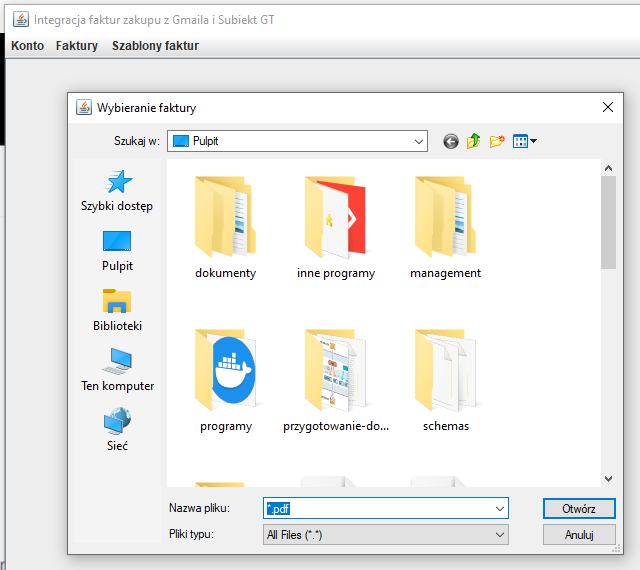
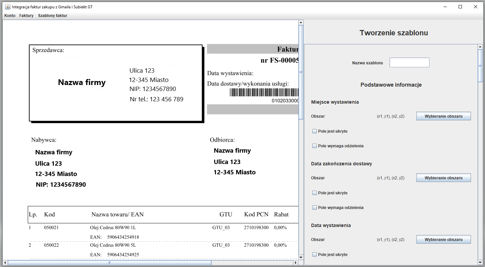
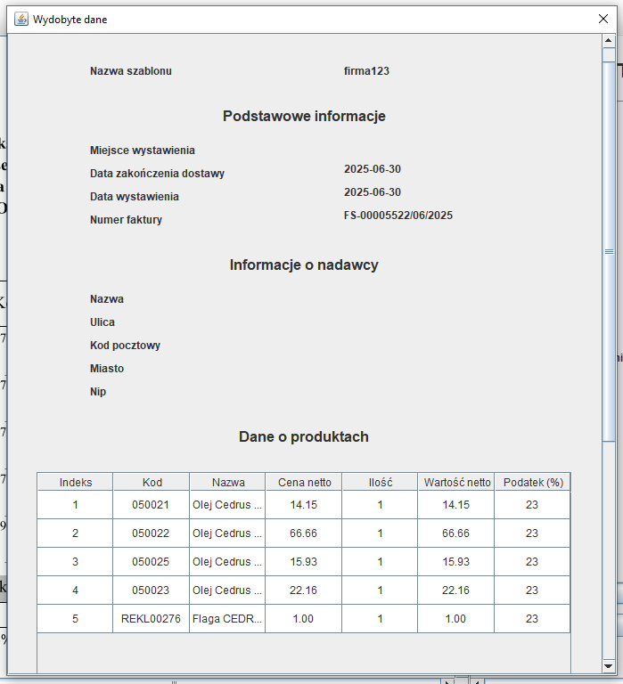

# Integracja Gmail i SubiektGT - faktury zakupu

## Wstęp

Repozytorium dotyczy aplikacji umożliwiającej pobranie z Gmail faktur zakupu w formacie pdf, odczytanie danych z tych faktur i następnie utworzenie na ich pdostawie faktur zakupu w SubiektGT.

W aplikacji pobierane są na początku wiadomości zawierające załączniki pdf dostępne w danej skrzynce Gmail. Następnie użytkownik może wybrać, które pdfy powinny być zapisane jako faktury zakupu w SubiektGT. Aplikacja wykorzystuje do komunikacji z Subiektem dodatek Sfera, dzięki czemu możliwe jest całkiem sprawne tworzenie faktur zakupu w SubiektGT. 

Do wydobycia danych o fakturach z plików pdf wykorzystywane są szablony faktur zakupu. Istotne jest, że aby dany pdf mógł być odczytany jako faktura zakupu, konieczne jest wcześniejsze zdefiniowanie szablonu dla tej faktury np. wskazanie w aplikacji w którym miejscu znajduje się na pliku pdf miejsce wystawienia faktury, czy data wystawienia faktury. Dla każdej firmy wymagane jest utworzenie nowego szablonu faktury zakupu.

Aplikacja obsługuje sytuacje, w których wiadomości e-mail zawierają wiele załączników o formacie pdf. W tym przypadku w aplikacji będą wyświetlane załączniki w osobnych wierszach w tabeli.

### Sfera

Jak już wspomniano, wykorzystanie Sfery umożliwia usprawnienie tworzenia faktur zakupu. Bez tej wtyczki, konieczne byłoby bazowanie na plikach, co byłoby dosyć kłopotliwe. Wtedy trzeba by było dla każdej faktury w pdf tworzyć plik z fakturą zakupu w formacie obsługiwanym przez SubiektGT. Następnie każdy plik należałoby zaimportować do Subiekta poprzez opcję Dodaj na podstawie. Jest to więcej roboty. Dzięki SubiektGT w aplikacji integracja wystarczy jedno kliknięcie typu Zapisz faktury zakupu w SubiektGT. Działa to dlatego, że Sfera umożliwia zestawienie API typu COM w SubiektGT i następnie poprzez to API można wysyłać żądania. Technologia COM jest często związana z językiem C#. Dodatek Sfera jest płatny, lecz na szczęście jednorazowo.

### Nakładka na Sferę

Jak już wspomniałem Sfera jest raczej związana z językiem C#. Ja niestety nie znam za bardzo tego języka i ograniczyłem się do Javy. Dlatego wykorzystałem nakładkę na Sfere napisaną przez kogoś innego w php. Wtyczka jest zamieszczona na 
[repozytorium GitHub Lukegpl](https://github.com/Lukegpl/api-subiekt-gt?tab=readme-ov-file).

Nakładka ta okazała się całkiem dobra. Przede wszystkim używa REST i JSON oraz jest dosyć dobrze 
[udokomentowana](https://github.com/Lukegpl/api-subiekt-gt/wiki/API-Dokumentacja-v.-1.0). Są szczegółowe informacje o realizowanych funkcjach np. jakie dane są wymagane dla poszczególnych endpointów oraz co prawdopodobnie będzie zwrócone. 

Niestety musiałem też trochę przerobić kod tej nakładki, aby spełniała moje potrzeby np. wprowadziłem możliwość tworzenia faktur zakupu, gdzie wcześniej było możliwe tworzenie bodajże jedynie faktur sprzedaży i paragonów zwykłych. Dodatkowo dałem tworzenie klienta jednorazowego przy zapisywaniu faktur, a we wcześniejszej wersji nakładki, klienci musieli już istnieć w Subiekcie przed dodaniem nowych obiektów. Dodatkowo w nakładce dodanie faktury musiało być poprzedzone dodaniem zamówienia od klienta. Również to zmieniłem i u mnie mogą być odrazu dodane dokumenty do Subiekta. Ostatnią rzecz jaką zmieniłem, którą pamietam, było dodanie możliwości tworzenia produktów, gdy nie istnieją one w SubiektGT.

### Wykorzystanie aplikacji

Aplikacja jest wykorzystywana produkcyjnie przez mojego znajomego zajmującego się sprzedażą w Allegro i zarządzaniem finansami i magazynem w Subiekt GT. Na chwile obecną jest zadowolony i w razie czego wprowadzam drobne poprawki. Najmniej przetestowaną funkcją jest tworzenie szablonów, głównie dlatego, że jest to najnowsza funkcja w mojej aplikacji. Dodatkowo tak naprawdę trudnym zadaniem jest przetestowanie wystarczająco tej funkcji, gdyż jest dosyć sporo formatów faktur, szczególnie mniejsze firmy mają własne formaty faktur, które często mocno się od siebie różnią. Moją aplikację przetestowałem na około 6 różnych formatach faktur.

Aby móc korzystać z aplikacji, konieczne jest dodanie użytkownika do listy użytkowników mogących korzystać z logowania poprzez Gmail. W większości przypadków polega to na tym, że dodaje się do listy użytkowników użytkownika identyfikowanego po adresie e-mail z Gmail. W razie potrzeby skorzystania z tej aplikacji na poważnie proszę napisać wiadomość na mój adres e-mail kamdyw@wp.pl i chętnie dodam adres e-mail do listy użytkowników.

### Technologie:
* Java,
* Swing,
* Maven,
* Gmail:
    - REST,
    - JSON,
    - Spring,
    - Spring Boot,
    - JWT,
    - OAuth 2.0,
    - HttpClient (wysyłanie żądań do Api od Gmail).
* SubiektGT:
    - SubiektGT Sfera,
    - COM,
    - Php (nakładka na sferę).
* Apache PDFBox,
* JUnit,
* Mockito,
* Git.

## Przed uruchomieniem aplikacji

### Wymagane narzędzia

#### Java

Do uruchomienia aplikacji potrzebne będzie zainstalowanie środowiska uruchomieniowego Javy (JRE) w wersji 17 albo późniejszej, gdyż moja aplikacja została napisana w Javie.

#### Sfera

Jak już wcześniej wspomniałem, aplikacja ta wykorzystuje Sferę, dlatego aby móc użytkować aplikację, niezbędne jest aktywowanie wtyczki Sfera w SubiektGT. Jest to wymagane mimo, iż aplikacja korzysta ze Sfery poprzez nakładkę.

### Instalacja

Dla aplikacji stworzyłem instalator `Integracja-Gmail-SubiektGt-Sfera.exe`, dzięki któremu można w prosty sposób zainstalować wszystkie wymagane składniki do działania aplikacji.

Na początku potrzebne jest podanie lokalizacji instalacji:
<p align="center">
    
<p>

Następnie można zmienić domyślną nazwę foldera z aplikacją w menu start:
<p align="center">
    
<p>

Poźniej można potwierdzić ustawienia i kliknąć instaluj:
<p align="center">
    
<p>

Po pomyślnym zainstalowaniu aplikacji powinno pojawić się takie okno:
<p align="center">
    
<p>

Dodatkowo powinien być utworzony na pulpicie plik uruchomieniowy aplikacji `Uruchom Integracja Gmail i Subiekt GT ze Sferą`. Za pomocą tego pliku możliwe jest proste uruchomienie aplikacji.

Aplikację też można odinstalować poprzez uruchomienie pliku `unins000.exe` w folderze, w którym została zainstalowana aplikacja. Ewentualnie program raczej będzie mógł być usunięty z poziomu listy programów do usunięcia.

## Po uruchomieniu aplikacji

Po pierwszym uruchomieniu aplikacji powinno pojawić się następujące okno:
<p align="center">
    
<p>

Aby aplikacja działała poprawnie, należy skonfigurować nakładkę na Sferę.

### Konfiguracja nakładki na Sferę

Należy m.in. podać nazwę bazy danych wykorzystywanej przez SubiektGT oraz nazwę użytkownika w SubiektGT.

#### Metoda 1

Nakładkę na Sferę można skonfigurować poprzez plik `htdocs/config/api-subiekt-gt.ini` znajdujący się w ścieżce zainstalowanego programu.
Wygląda on mniej więcej tak.
```
server = "adres serwera bazy danych Subiekta"

dbuser = "login do bazy danych"

dbpassword = "haslo do bazy danych"

database = "nazwa bazy danych"

id_person = "Imię i nazwisko osoby na fakturze"

operator = "Użytkownik Subiekta np. Szef"

operator_password = "Hasło użytkownika Subiekta"

```

Podano parametry, które prawdopodobnie trzeba będzie skonfigurować.

#### Metoda 2

Drugim sposobem jest skorzystanie ze strony dostarczanej przez autora nakładki na Sferę `http://localhost/public/setup/`.
<p align="center">
    
<p>

Wystarczy uzupełnienie tych parametrów, które podano w metodzie 1.

Po skonfigurowaniu parametrów należy kliknąć przycisk Zapisz konfigurację i dzięki temu zostanie uzupełniony plik z metody 1.

Po tym kroku można już przejść do aplikacji integracja.

Następnym krokiem jest połączenie aplikacji z Allegro.

### Połącznie aplikacji z Gmail

Kolejnym krokiem jest zalogowanie się na konto Gmail, aby aplikacja mogła pobierać wiadomości z tego konta.

Po naciśnięciu logowanie do aplikacji powinno nastąpić przekierowanie do przeglądarki z wyborem konta Gmail albo zalogowanie się na jakieś konto:
<p align="center">
    
<p>

Po wyborze konta albo zalogowaniu się na jakieś konto powinno się pojawić następujące okno:
<p align="center">
    
<p>

Zgadza się, aplikacja nie została jeszcze zweryfikowana :D. Jeśli moja aplikacja nie wygląda na oszustwo, to
polecam przejść dalej.

Powinno się pojawić okno, w którym przedstawione są uprawnienia jakie uzyska moja aplikacja do wybranego konta Gmail.
<p align="center">
    
<p>

Jeśli moja aplikacja budzi zaufanie, to ostatnim krokiem jest zatwierdzenie dostępu aplikacji do wybranego konta Gmail.

Po pomyślnym zalogowaniu powinna się pojawić strona z następującym napisem:
<p align="center">
    
<p>

Teraz polecam przejście do aplikacji integracja.

Po tych krokach powinno się pojawić już okno z wiadomościami z konta Gmail:
<p align="center">
    
<p>

Aplikacja po tych krokach jest już w pełni funkcjonalna.

## Po zalogowaniu i skonfigurowaniu aplikacji

### Wylogowanie

Po zalogowaniu się na niewłaściwe konto można skorzystać z opcji wylogowania się poprzez wejście w menu Konto:
<p align="center">
    
<p>

Po tym kroku będzie można ponownie połączyć aplikację, lecz tym razem np. z innym kontem Gmail.

### Szablony

#### Wstęp

Aplikacja integracja odczytuje dane z faktur zapisanych w formie plików pdf z Gmaila poprzez zastosowanie szablonów faktur. Założono, że dla każdej firmy sprzedającego jest osobny szablon, gdyż zazwyczaj firmy mają różne formaty faktur. Mając szablon dla danej firmy i fakturę wystawioną przez tę firmę, to możliwe będzie odczytanie danych z takiej faktury. Zatem, aby poprawnie odczytać dane z faktury i następnie utworzyć fakturę zakupu w SubiektGT, dla faktury tej powinien istnieć w aplikacji integracja szablon faktury, który jest zgodny z tą fakturą.

Szablony zapisywane są jako pliki typu .json. Szablon zawiera przede wszystkim informacje o tym, w którym miejsu na fakturze pdf znajdują się kolejne dane, które mają być odczytane. Przykładami takich danych są miejce wystawienia faktury, czy końcowa cena. Dodatkowo szablony mają nazwy, które są istotne w przypadku wybierania odpowiedniego szablonu do otrzymanego pliku pdf zawierającego fakturę. Nazwa szablonu jest sprawdzana w dwóch miejscach:
1. Wiadomość e-mail:
    1. Tytuł,
    2. Adres e-mail osoby wysyłającej fakturę,
    3. Zawartość.
2. Tekst faktury w pliku pdf.

Na początku sprawdzana jest wiadomość e-mail, a później tekst faktury w pliku pdf. Podobnie jest w przypadku tytułu wiadomości e-mail itp. Gdy udało się dopasować szablon faktury do wybranej faktury w formie pliku pdf, to będzie można dodać w Subiekcie odpowiednią fakturę zakupu.

#### Lista szablonów

W aplikacji integracja utworzone szablony można przeglądać w oknie "Dostępne schematy faktur" dostępnym w górnym menu pod tytułem "Szablony faktur":
<p align="center">
    
<p>

Powinna się pojawić lista z szablonami faktur:
<p align="center">
    
<p>

Z poziomu tego okna można dodatkowo usunąć niektóre szablony.

#### Dodawanie szablonu

Dodawanie szablonu polega na wyborze przykładowej faktury zapisanej w pliku pdf i następnie zaznaczeniu, w których miejscach w pliku pdf znajdują się niektóre dane np. data wystawienia faktury, czy cena końcowa.

Dodawanie szablonu jest możliwe poprzez wejście w opcję "Dodaj szablon faktury" dostępną w górnym menu pod tytułem "Szablony faktur":
<p align="center">
    
<p>

Po wybraniu tej opcji powinno się pojawić okno wyboru przykładowej faktury zapisanej w pliku pdf:
<p align="center">
    
<p>

Po wybraniu pliku pdf z fakturą, faktura ta powinna zostać wczytana w aplikacji:
<p align="center">
    
<p>

Po tych krokach możliwe już będzie skonfigurowanie szablonu faktury i późniejsze zapisanie go w aplikacji.

Na początku należy wybrać nazwę szablonu faktury. Dobranie tej nazwy jest ważne, aby sprawnie udało się dobrać szablon faktury do otrzymanej faktury zapisanej w pliku pdf.

Następnie proponuję uzupełnienie pozostałych pól. W większości przypadków ich uzupełnienie będzie polegało na kliknięciu przycisku "Wybieranie obszaru" przy polu, które ma być ustawione oraz następnie zaznaczenie na pliku pdf z fakturą odpowiedniego miejsca:
<p align="center">
    
<p>

Do tego celu należy kliknąć w wybranym miejscu na fakturze w pdf lewy przycisk myszy. Wtencyas pojawi się czerwony prostokąt, który będzie się zwiększał z każdym ruchem myszki. Zapisanie obszaru można zapewnić poprzez drugie kliknięcie lewego przycisku myszy:

Dodatkowo po wyborze obszaru powinno się pojawić okno z wybranymi współrzędnymi, szerokością i wysokością tego obszaru.

Pola do uzupełnienia są pogrupowane:
* Podstawowe informacje np. data wystawienia faktury,
* Dane osoby wystawiającej fakturę np. nazwa firmy,
* Dane o produktach np. ich ceny,
* Cena końcowa w netto,
* Termin płatności.

Są dwa rodzaje grup pól:
* Zawierające znane położenie w pionie i poziomie np. podstawowe informacje,
* Zawierające znane położenie jedynie w poziomie np. cena końcowa.

W pierwszym przypadku wystarczy wybór odpowiednich obszarów:
<p align="center">
      
<p>

Niestety w drugim przypadku jest trochę ciężej:
<p align="center">
    
<p>

Założono, że pozycja pionowa może się różnić, np. dla większej liczby produktów cena końcowa może być trochę niżej. Dodatkowo dla tegp typu grupy wszystkie parametry znajdują się na tej samej wysokości. Jednak może istnieć wiele zestawów parametrów np. wiele produktów. W tym przypadku opróć wybrania obszarów dla kolejnych pól należy jeszcze uzupełnić inne pola. Przede wszystkim należy podać początek linii, który będzie brany pod uwagę jako punkt odniesienia dla pól z grupy, od którego miejsca zaczynają się szukane pola. Początkowa linia może się znajdować w tej samej linii co szukane pole albo wyżej. Liczbę linii wyżej niż szukane pole można ustawić poprzez parametr "Liczba linii do pominięcia". Brane są pod uwagę jedynie linie, które nie są puste. Kolejnym parametrem jest początek linii, na której kończy się ustawiane pole. Ostatnim parametrem jest wysokość linii dla poszukiwanego pola. Pole to proponuję ustawić poprzez naciśnięcie przycisku "Czyszczenie zaznaczenia", aby nie nadpisać poprzednio wybranych pól, następnie wybrać obszar na pdfe i odczytać otrzymaną wysokość oraz uzupełnić parametr wysokość linii.

Wypełniane pola mogą mieć również kilka typów:
1. Zawierające położenie w pionie i poziomie np. miejsce wystawienia faktury,
2. Zawierające położenie w poziomie np. kwota końcowa,
3. Wartości, których nie ma w pliku pdf oraz te, które nie są w fakturze tekstem, lecz np. obrazkiem,
4. Wartości wymagające odzielenia.

Pierwsze i drugie typy pól są ustalane według ich grupy. Trzeci typ jest możliwy do uzyskania poprzez zaznaczenie opcji "Pole jest ukryte":
<p align="center">
    
<p>

W tym przypadku wystarczy uzupełnienie domyślnej wartości.

Ostatni typ przyade się, gdy np. w jednej kolumnie znajdują się wartości z osobnych pól, które są oddzielone jakimś znakiem. Aby ustawić takie pole wystarczy zaznaczenie opcji "Pole wymaga oddzielenia":
<p align="center">
    
<p>

Przykładem są miejsce wystawienia faktury oraz data zakończenia dostawy oddzielone znakiem "-".

Po uzupełnieniu wszystkich pól albo na bieżąco można sprawdzić, jakie dane są poprawnie odczytywane z faktury. Do tegp celu można posłużyć się przyciskiem "Przetestuj szablon":
<p align="center">
    
<p>

Powinno pojawić się okno z wczytami albo i nie danymi:
<p align="center">
    
<p>

Jeśli wszystkie dane udało się wczytać, to wystarczy już zapisanie szablonu poprzez kliknięcie w przycisk "Zapisz szablon". Szablon zostanie zapisany z nazwą, która została podana. Od tej pory szablon będzie również obecny w liście szablonów.

### Faktury

Do widoku z fakturami z Gmail możliwe jest przede wszystkim przejście poprzez opcję "Lista faktur" w menu "Faktury":
<p align="center">
    
<p>

Ewentualnie po uruchomieniu aplikacji integracja odrazu będzie widoczny widok z fakturami.

Przykładowy widok faktur:
<p align="center">
    
<p>

Strony z fakturami można zmieniać poprzez strzałki przy numerze strony. Dodatkowo możliwe jest zmienienie liczby pobieranych wiadomości dla jednej strony.

Wyszukiwane są na początku wiadomości e-mail z Gmaila, które zawierają szukany tekst np. domyślnie jest to tekst Faktura. Sprawdzane jest, czy tekst ten jest zawarty w tytule, zawartości wiadomości, czy w załączniku. Dodatkowo pobierane są te wiadomości, które zawierają załączniki pdf oraz ich autorem jest ktoś inny, niż wykorzystane konto Gmail do zalogowania się do aplikacji integracja.

Jednak problem pojawia się w przypadku istnienia wielu załączników zawierających pliki pdf w danej wiadomości Gmail. Z tego powodu w aplikacji integracja osobną pozycją w tabeli jest załącznik, a nie wiadomość. Załącznik jest identyfikowany numerem załącznika w danej wiadomości e-mail.

Innym ważnym parametrem w wierszu tabeli jest Subiekt Id załącznika. Pole to wskazuje na Symbol faktury zakupu zapisanej w subiekcie. Jeśli w Subiekcie nie istnieje jeszcze faktura zakupu dla danego załącznika, to wtenczas pole to będzie miało wartość brak. Warto dodać, że w rzeczywistości wartość brak będzie również wtedy, gdy faktura zakupu została dodana nie przez aplikację integracja. Aplikacja integracja ma informacje o tym, czy dla danego załącznika utworzono fakturę zakupu poprzez polę Uwagi w danej fakturze zakupu w SubiektGT. Pole to jest ustawiane jako "identyfikator załącznika,numer załącznika". Warto dodać, że numer załącznika jest liczony od 0, a nie od 1.

Innymi danymi obecnymi w wierszach tabeli są nadawca wiadomości, temat wiadomości oraz data wysłania wiadomości.

Aby zapisać dane faktury zakupu w Subiekcie, należy na początku zaznaczyć wybrane załączniki w tabeli poprzez zaznaczenie myszką odpowiednich pozycji. Do zaznaczenia kilku opcji można też użyć wybierania pozycji wraz z trzymaniem klawisza Ctrl. Można również zaznaczyć wszystkie pozycje na liście poprzez kliknięcie w przycisk "Zaznacz wszystkie dane". Ewentualnie można tez dane odznaczyć poprzez przycisk "Odznacz wszystkie dane".

Po zaznaczeniu wybranych załączników, które mają być zapisane jako faktury zakupu w SubiektGT, wystarczy już kliknąć przycisk "Zapisz faktury zakupu w Subiekcie". W przypadku udanej operacji powinien pojawić się komunikat potwierdzający utworzenie faktur zakupu oraz dodatkowo będzie podana liczba dodanych faktur zakupu. Z kolei jeśli nie udało się dodać pewnych faktur, wtenczas zostanie wyświetlony komunikat o błędzie, dla których załączników operacja się nie udała.