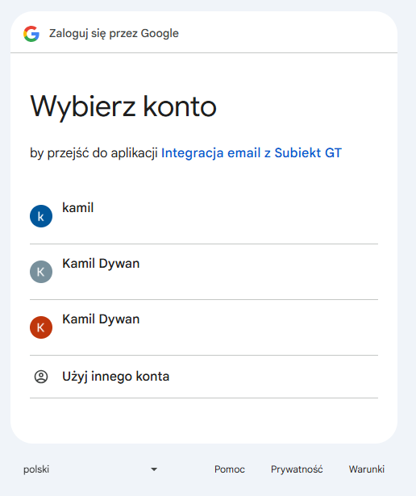
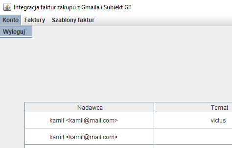

# Integracja Gmail i SubiektGT - faktury zakupu

## Wstęp

Repozytorium dotyczy aplikacji umożliwiającej pobranie z Gmail faktur zakupu w formacie pdf, odczytanie danych z tych faktur i następnie utworzenie na ich pdostawie faktur zakupu w SubiektGT.

W aplikacji pobierane są na początku wiadomości zawierające załączniki pdf dostępne w danej skrzynce Gmail. Następnie użytkownik może wybrać, które pdfy powinny być zapisane jako faktury zakupu w SubiektGT. Aplikacja wykorzystuje do komunikacji z Subiektem dodatek Sfera, dzięki czemu możliwe jest całkiem sprawne tworzenie faktur zakupu w SubiektGT. 

Do wydobycia danych o fakturach z plików pdf wykorzystywane są szablony faktur zakupu. Istotne jest, że aby dany pdf mógł być odczytany jako faktura zakupu, konieczne jest wcześniejsze zdefiniowanie szablonu dla tej faktury np. wskazanie w aplikacji w którym miejscu znajduje się na pliku pdf miejsce wystawienia faktury, czy data wystawienia faktury. Dla każdej firmy wymagane jest utworzenie nowego szablonu faktury zakupu.

Aplikacja obsługuje sytuacje, w których wiadomości e-mail zawierają wiele załączników o formacie pdf. W tym przypadku w aplikacji będą wyświetlane załączniki w osobnych wierszach w tabeli.

### Sfera

Jak już wspomniano, wykorzystanie Sfery umożliwia usprawnienie tworzenia faktur zakupu. Bez tej wtyczki, konieczne byłoby bazowanie na plikach, co byłoby dosyć kłopotliwe. Wtedy trzeba by było dla każdej faktury w pdf tworzyć plik z fakturą zakupu w formacie obsługiwanym przez SubiektGT. Następnie każdy plik należałoby zaimportować do Subiekta poprzez opcję Dodaj na podstawie. Jest to więcej roboty. Dzięki SubiektGT w aplikacji integracja wystarczy jedno kliknięcie typu Zapisz faktury zakupu w SubiektGT. Działa to dlatego, że Sfera umożliwia zestawienie API typu COM w SubiektGT i następnie poprzez to API można wysyłać żądania. Technologia COM jest często związana z językiem C#. Dodatek Sfera jest płatny, lecz na szczęście jednorazowo.

### Nakładka na Sferę

Jak już wspomniałem Sfera jest raczej związana z językiem C#. Ja niestety nie znam za bardzo tego języka i ograniczyłem się do Javy. Dlatego wykorzystałem nakładkę na Sfere napisaną przez kogoś innego w php. Wtyczka jest zamieszczona na 
[repozytorium GitHub Lukegpl](https://github.com/Lukegpl/api-subiekt-gt?tab=readme-ov-file).

Nakładka ta okazała się całkiem dobra. Przede wszystkim używa REST i JSON oraz jest dosyć dobrze 
[udokomentowana](https://github.com/Lukegpl/api-subiekt-gt/wiki/API-Dokumentacja-v.-1.0). Są szczegółowe informacje o realizowanych funkcjach np. jakie dane są wymagane dla poszczególnych endpointów oraz co prawdopodobnie będzie zwrócone. 

Niestety musiałem też trochę przerobić kod tej nakładki, aby spełniała moje potrzeby np. wprowadziłem możliwość tworzenia faktur zakupu, gdzie wcześniej było możliwe tworzenie bodajże jedynie faktur sprzedaży i paragonów zwykłych. Dodatkowo dałem tworzenie klienta jednorazowego przy zapisywaniu faktur, a we wcześniejszej wersji nakładki, klienci musieli już istnieć w Subiekcie przed dodaniem nowych obiektów. Dodatkowo w nakładce dodanie faktury musiało być poprzedzone dodaniem zamówienia od klienta. Również to zmieniłem i u mnie mogą być odrazu dodane dokumenty do Subiekta. Ostatnią rzecz jaką zmieniłem, którą pamietam, było dodanie możliwości tworzenia produktów, gdy nie istnieją one w SubiektGT.

### Wykorzystanie aplikacji

Aplikacja jest wykorzystywana produkcyjnie przez mojego znajomego zajmującego się sprzedażą w Allegro i zarządzaniem finansami i magazynem w Subiekt GT. Na chwile obecną jest zadowolony i w razie czego wprowadzam drobne poprawki. Najmniej przetestowaną funkcją jest tworzenie szablonów, głównie dlatego, że jest to najnowsza funkcja w mojej aplikacji. Dodatkowo tak naprawdę trudnym zadaniem jest przetestowanie wystarczająco tej funkcji, gdyż jest dosyć sporo formatów faktur, szczególnie mniejsze firmy mają własne formaty faktur, które często mocno się od siebie różnią. Moją aplikację przetestowałem na około 6 różnych formatach faktur.

Aby móc korzystać z aplikacji, konieczne jest dodanie użytkownika do listy użytkowników mogących korzystać z logowania poprzez Gmail. W większości przypadków polega to na tym, że dodaje się do listy użytkowników użytkownika identyfikowanego po adresie e-mail z Gmail. W razie potrzeby skorzystania z tej aplikacji na poważnie proszę napisać wiadomość na mój adres e-mail kamdyw@wp.pl i chętnie dodam adres e-mail do listy użytkowników.

### Technologie:
* Java,
* Swing,
* Maven,
* Gmail:
    - REST,
    - JSON,
    - Spring,
    - Spring Boot,
    - JWT,
    - OAuth 2.0,
    - HttpClient (wysyłanie żądań do Api od Gmail).
* SubiektGT:
    - SubiektGT Sfera,
    - COM,
    - Php (nakładka na sferę).
* Apache PDFBox,
* JUnit,
* Mockito,
* Git.

## Przed uruchomieniem aplikacji

### Wymagane narzędzia

#### Java

Do uruchomienia aplikacji potrzebne będzie zainstalowanie środowiska uruchomieniowego Javy (JRE) w wersji 17 albo późniejszej, gdyż moja aplikacja została napisana w Javie.

#### Sfera

Jak już wcześniej wspomniałem, aplikacja ta wykorzystuje Sferę, dlatego aby móc użytkować aplikację, niezbędne jest aktywowanie wtyczki Sfera w SubiektGT. Jest to wymagane mimo, iż aplikacja korzysta ze Sfery poprzez nakładkę.

### Instalacja

Dla aplikacji stworzyłem instalator `Integracja-Gmail-SubiektGt-Sfera.exe`, dzięki któremu można w prosty sposób zainstalować wszystkie wymagane składniki do działania aplikacji.

Na początku potrzebne jest podanie lokalizacji instalacji:
<p align="center">
    
<p>

Następnie można zmienić domyślną nazwę foldera z aplikacją w menu start:
<p align="center">
    
<p>

Poźniej można potwierdzić ustawienia i kliknąć instaluj:
<p align="center">
    
<p>

Po pomyślnym zainstalowaniu aplikacji powinno pojawić się takie okno:
<p align="center">
    
<p>

Dodatkowo powinien być utworzony na pulpicie plik uruchomieniowy aplikacji `Uruchom Integracja Gmail i Subiekt GT ze Sferą`. Za pomocą tego pliku możliwe jest proste uruchomienie aplikacji.

Aplikację też można odinstalować poprzez uruchomienie pliku `unins000.exe` w folderze, w którym została zainstalowana aplikacja. Ewentualnie program raczej będzie mógł być usunięty z poziomu listy programów do usunięcia.

## Po uruchomieniu aplikacji

Po pierwszym uruchomieniu aplikacji powinno pojawić się następujące okno:
<p align="center">
    
<p>

Aby aplikacja działała poprawnie, należy skonfigurować nakładkę na Sferę.

### Konfiguracja nakładki na Sferę

Należy m.in. podać nazwę bazy danych wykorzystywanej przez SubiektGT oraz nazwę użytkownika w SubiektGT.

#### Metoda 1

Nakładkę na Sferę można skonfigurować poprzez plik `htdocs/config/api-subiekt-gt.ini` znajdujący się w ścieżce zainstalowanego programu.
Wygląda on mniej więcej tak.
```
server = "adres serwera bazy danych Subiekta"

dbuser = "login do bazy danych"

dbpassword = "haslo do bazy danych"

database = "nazwa bazy danych"

id_person = "Imię i nazwisko osoby na fakturze"

operator = "Użytkownik Subiekta np. Szef"

operator_password = "Hasło użytkownika Subiekta"

```

Podano parametry, które prawdopodobnie trzeba będzie skonfigurować.

#### Metoda 2

Drugim sposobem jest skorzystanie ze strony dostarczanej przez autora nakładki na Sferę `http://localhost/public/setup/`.
<p align="center">
    
<p>

Wystarczy uzupełnienie tych parametrów, które podano w metodzie 1.

Po skonfigurowaniu parametrów należy kliknąć przycisk Zapisz konfigurację i dzięki temu zostanie uzupełniony plik z metody 1.

Po tym kroku można już przejść do aplikacji integracja.

Następnym krokiem jest połączenie aplikacji z Allegro.

### Połącznie aplikacji z Gmail

Kolejnym krokiem jest zalogowanie się na konto Gmail, aby aplikacja mogła pobierać wiadomości z tego konta.

Po naciśnięciu logowanie do aplikacji powinno nastąpić przekierowanie do przeglądarki z wyborem konta Gmail albo zalogowanie się na jakieś konto:
<p align="center">
    
<p>

Po wyborze konta albo zalogowaniu się na jakieś konto powinno się pojawić następujące okno:
<p align="center">
    
<p>

Zgadza się, aplikacja nie została jeszcze zweryfikowana :D. Jeśli moja aplikacja nie wygląda na oszustwo, to
polecam przejść dalej.

Powinno się pojawić okno, w którym przedstawione są uprawnienia jakie uzyska moja aplikacja do wybranego konta Gmail.
<p align="center">
    
<p>

Jeśli moja aplikacja budzi zaufanie, to ostatnim krokiem jest zatwierdzenie dostępu aplikacji do wybranego konta Gmail.

Po pomyślnym zalogowaniu powinna się pojawić strona z następującym napisem:
<p align="center">
    
<p>

Teraz polecam przejście do aplikacji integracja.

Po tych krokach powinno się pojawić już okno z wiadomościami z konta Gmail:
<p align="center">
    
<p>

Aplikacja po tych krokach jest już w pełni funkcjonalna.

## Po zalogowaniu i skonfigurowaniu aplikacji

### Wylogowanie

Po zalogowaniu się na niewłaściwe konto można skorzystać z opcji wylogowania się poprzez wejście w menu Konto:
<p align="center">
    
<p>

Po tym kroku będzie można ponownie połączyć aplikację, lecz tym razem np. z innym kontem Gmail.

### Szablony